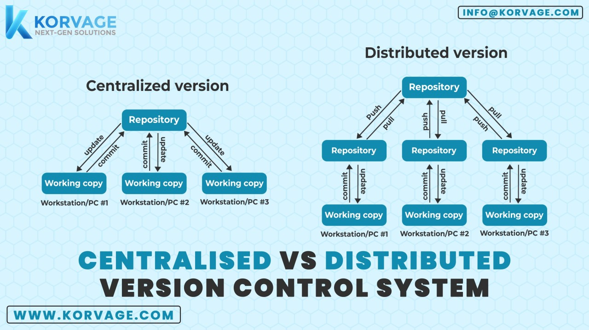
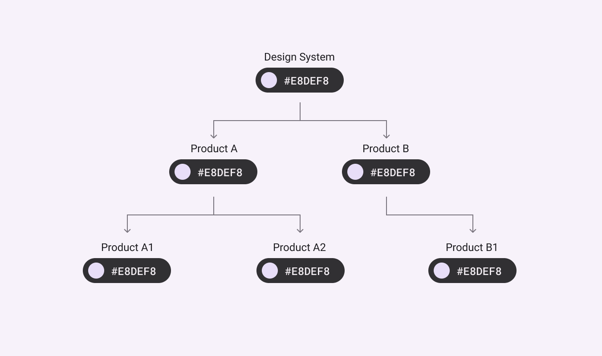
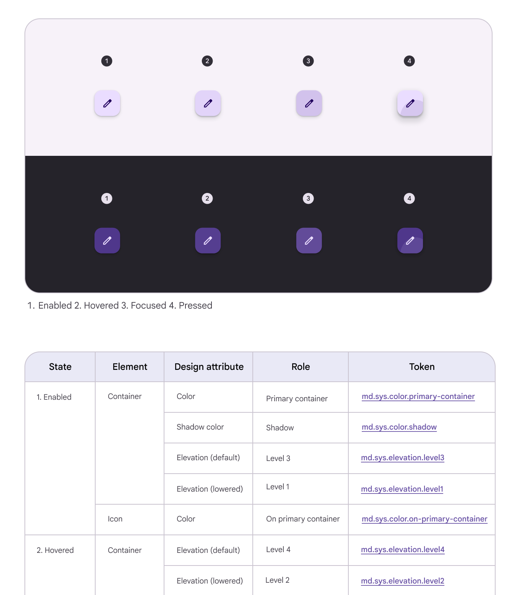
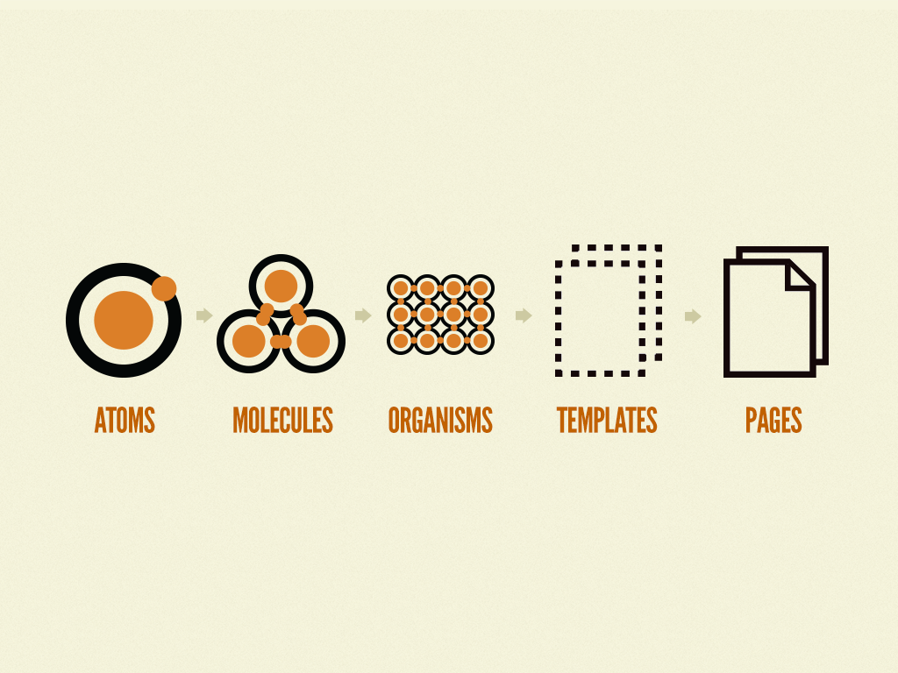

# cp-origin-web-centralize (Web Design System)

### Tech Stacks
- React + Ts
- Storybook (Figma addons included)
- Style Dictionary
- TailwindCss
- ChangeSets (WIP)
- Chromatic (WIP)

### Project Diagrams (Key Main Project)

### Why Design System ?
- Source of truth
- Functional Consistency
- Focus on hard engineering problems

### What is Design Tokens

Learn more https://m3.material.io/foundations/design-tokens/overview

Design tokens are central and tiny pieces of Ui information that will be used across serveral platforms such as 
- Color Value
- Spacing
- Animation
- Shadows

### Atomic Design 

